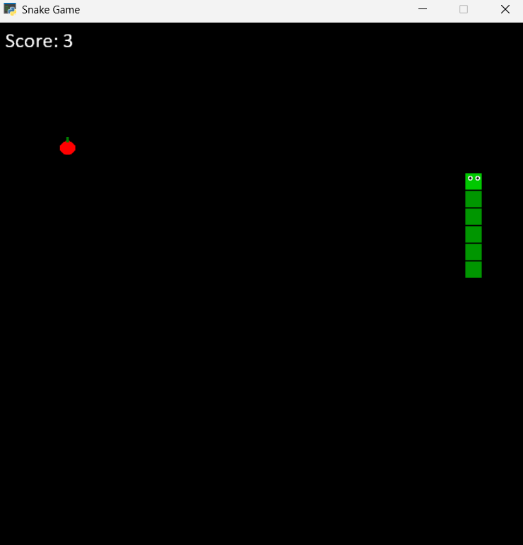
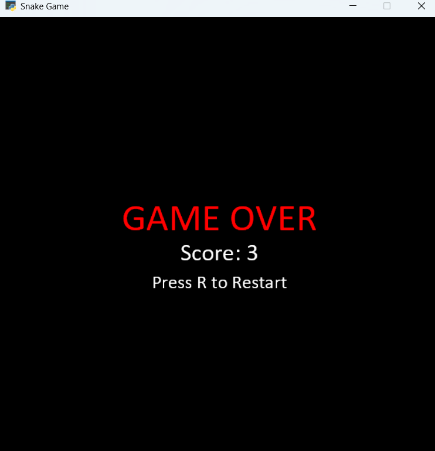

# 🐍 Snake Game

A classic Snake Game built with Python and the Arcade library.

## 🎮 How to Play

- Use **Arrow Keys** to control the snake
- Eat the **🍎 apple** to grow and increase score
- Avoid hitting the **walls** or **yourself**
- Press **R** to restart after Game Over

## 🛠️ How to Run

### 1. Clone the repository
git clone https://github.com/YOURUSERNAME/snake_game.git

### 2. Create virtual environment
python -m venv venv

### 3. Activate virtual environment
venv\Scripts\activate

### 4. Install requirements
pip install -r requirements.txt

### 5. Create game assets
python create_assets.py

### 6. Run the game
python snake.py

## 📦 Requirements

- Python 3.8+
- Arcade
- Pillow

## 📁 Project Structure

Snake_Game/
├── assets/
│   ├── apple.png
│   ├── snake_head.png
│   └── snake_body.png
├── images/
│   └── screenshot.png
├── snake.py
├── create_assets.py
├── requirements.txt
├── README.md
└── .gitignore
